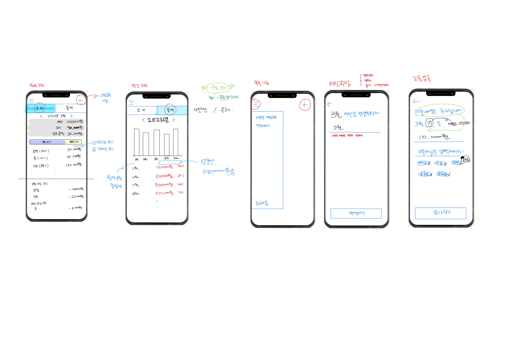

# 가계부 개발 프로젝트

### 프로젝트명

- 지출케어가계부

### 프로젝트 배경

- 종이가계부를 사용하는 경우 주말에 몰아서 기입하는 경우가 많음
- 현재 지출상황이 제대로 공유되지 않아 돈이 많은 줄 알고 과소비 발생
- 기존의 가계부 앱들은 기능이 너무 많아서 불편함

### 프로젝트 소개

- 부부/커플/친구가 함께 공유하고 실시간으로 입력이 가능한 가계부
- 월 예산을 정해놓고 지출을 모니터링하는 목적을 가진 가계부

### 기대 효과

- 지출을 실시간으로 파악하여 예산에 맞게 돈을 써서 과소비를 막는다.
- 적절한 지출 관리로 부자가 된다.

### 프로젝트 컨셉

- 심플하고 쉬운 기능과 UI
- 지출 집중 케어

### 기능

- 가계부 공유
- 지출 입력, 조회, 수정, 삭제
- 태그 입력, 조회, 삭제
- 소비 조회(월 단위 / 연단위)
- 이번달 예산 입력, 수정
- 엑셀내리기

### 기획 기간

- 2023.03.19(일) 기획서 1차 완료
- 2023.03.20(월) 기획서 발표 및 계획 구상

### 참여인원 / 개발스택

- 백 - 박도현 (Java, Spring, AWS)
- 프론트 - 추문영 ( Next.js, Typescript, React)

### 개발 일정

- 2023.05.22(월) ~ **진행중**

### UI 와이어프레임

### 개발 구현 목록

#### Backend
- [x]  DB 설계
- [x]  DB 구현
---
- [x]  예산
- [x]  소비
- [x]  태그
---
- [ ]  로그인 / 로그아웃
- [ ]  공유 기능

#### Frontend
- [x]  월 조회 UI
- [x]  연 조회 UI
- [x]  소비 입력 UI
- [x]  예산 입력 UI
- [ ]  사이드바 UI
- [ ]  로그인 UI
- [ ]  엑셀내리기
- [ ]  **API 연결 작업*****
